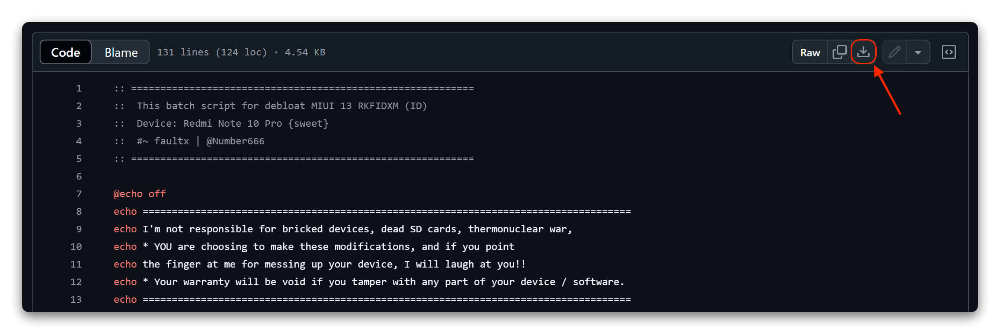

>[!Caution]
>Your warranty is now void.
>
>I am not responsible for bricked devices, dead SD cards,thermonuclear war, or you getting fired because the alarm app failed. Please do some research if you have any concerns about features included before flashing it! YOU are choosing to make these modifications, and if you point the finger at me for messing up your device, I will laugh at you.
>
> [`FaultX`](https://t.me/faultx003)

---


# Xiaomi Redmi Note 10 Pro (sweet)
Released March 2021

|  | Spesification |
|---------------|--|
| SoC | Qualcomm SM7150-AC Snapdragon 732G |
| RAM | 6/8 GB |
| CPU | Octa-core Kryo 470 2 x  2.3 GHz + 6 x 1.8 GHz |
| Architecture | arm64 |
| GPU | Qualcomm Adreno 618 |
| Network | 2G GSM, 2G CDMA, 3G UMTS, 4G LTE |
| Storage | 64/128/256 GB, UFS 2.2 |
| SD card	| Up to 512 GB |
| Screen | 6.67 in (169.42 mm), 2400x1080 (394 PPI), AMOLED (max. 120 Hz) |
| Bluetooth | 5.1 with A2DP + aptX HD |
| Wi-Fi | 802.11 a/b/g/n/ac |
| Peripherals | 3.5mm jack, A-GPS, Accelerometer, Compass, Dual SIM, FM radio, Fingerprint reader, BeiDou, Galileo, GLONASS, GPS, Gyroscope, IR blaster, Light sensor, NFC, Ultrasound, proximity sensor, USB OTG |
| Cameras | 108 MP, LED flash, 8 MP (ultrawide) LED flash, 5 MP (macro) LED flash, 2 MP (depth) LED flash, 16 MP, No flash |
| Dimensions | 164 mm (6.46 in) (h), 76.5 mm (3.01 in) (w), 8.1 mm (0.32 in) (d) |
| Battery | Non-removable Li-Po 5020 mAh |

---

# MIUI Official ROMs Archive | Redmi Note 10 Pro (sweet)

> [!WARNING]
> Make sure to download exact firmware for your model. You can discern your model from Settings > About phone > MIUI version (Eg: In MIUI version `V14.0.9.0.TKFMIXM` ‘<ins>**MI**</ins>’ represents your phone region, which is <ins>**Global**</ins>). You can also verify your Xiaomi phone at official site.

> [!NOTE]
> If you are currently or previously using a ROM/Custom ROM (AOSP) and want to flash MIUI to MIUI 14/13/12, I recommend doing [**this**](https://t.me/faultx003/303) . The goal is to ensure that when you're on MIUI, you won't encounter a message like this: _"Find Device storage corrupt. Your device is unsafe now."_

<details>

<summary>GLOBAL (MI)</summary>

| MIUI | Region | Branch | Android | Type | Size | Link | Mirror |
| :---: |--------|--------|:---:|------|------|------| :---: |
| **MIUI 14** |
|`V14.0.9.0.TKFMIXM`| GLOBAL | STABLE | 13.0 | Recovery | 4.08 GB | [Download](https://bn.d.miui.com/V14.0.9.0.TKFMIXM/miui_SWEETGlobal_V14.0.9.0.TKFMIXM_b774d114f4_13.0.zip) | [OD](https://x3p1w-my.sharepoint.com/:u:/g/personal/faultx_x3p1w_onmicrosoft_com/ERz9KOP5RkZDiuU3linOLmYB2Q8drEhF53rw-FFIpKzJ1g?e=8fwgpZ) |
|`V14.0.8.0.TKFMIXM`| GLOBAL | STABLE | 13.0 | Recovery | 4.1 GB | [Download](https://bkt-sgp-miui-ota-update-alisgp.oss-ap-southeast-1.aliyuncs.com/V14.0.8.0.TKFMIXM/miui_SWEETGlobal_V14.0.8.0.TKFMIXM_3e19ed98ed_13.0.zip) | [OD](https://x3p1w-my.sharepoint.com/:u:/g/personal/faultx_x3p1w_onmicrosoft_com/ESIRA6yaSilLtAEq-kYGrvQBOeyqTiinreYYdKoo0ANxVA?e=hNfhec) |
|`V14.0.8.0.TKFMIXM`| GLOBAL | STABLE | 13.0 | Fastboot | 7.1 GB | [Download](https://bkt-sgp-miui-ota-update-alisgp.oss-ap-southeast-1.aliyuncs.com/V14.0.8.0.TKFMIXM/sweet_global_images_V14.0.8.0.TKFMIXM_20231016.0000.00_13.0_global_86d031c692.tgz) | [OD](https://x3p1w-my.sharepoint.com/:u:/g/personal/faultx_x3p1w_onmicrosoft_com/EZccdAw-ZYhOnq_mRWNIvJcBWaRrzSJLPKzFFtWH_8xT_Q?e=rkliqg) |
| **MIUI 13** | 
|`V13.0.18.0.SKFMIXM`| GLOBAL | STABLE | 12.0 | Recovery | 3.4 GB | [Download](https://bkt-sgp-miui-ota-update-alisgp.oss-ap-southeast-1.aliyuncs.com/V13.0.18.0.SKFMIXM/miui_SWEETGlobal_V13.0.18.0.SKFMIXM_084b1b925a_12.0.zip) | - |
|`V13.0.18.0.SKFMIXM`| GLOBAL | STABLE | 12.0 | Fastboot | 6.0 GB | [Download](https://bkt-sgp-miui-ota-update-alisgp.oss-ap-southeast-1.aliyuncs.com/V13.0.18.0.SKFMIXM/sweet_global_images_V13.0.18.0.SKFMIXM_20230218.0000.00_12.0_global_18daa61696.tgz) | - |
| **MIUI 12** | 
|`V12.5.9.0.RKFMIXM`| GLOBAL | STABLE | 11.0 | Recovery | 3.1 GB | [Download](https://bkt-sgp-miui-ota-update-alisgp.oss-ap-southeast-1.aliyuncs.com/V12.5.9.0.RKFMIXM/miui_SWEETGlobal_V12.5.9.0.RKFMIXM_9a9a09a8de_11.0.zip) | - |
|`V12.5.9.0.RKFMIXM`| GLOBAL | STABLE | 11.0 | Fastboot | 5.7 GB | [Download](https://bkt-sgp-miui-ota-update-alisgp.oss-ap-southeast-1.aliyuncs.com/V12.5.9.0.RKFMIXM/sweet_global_images_V12.5.9.0.RKFMIXM_20211203.0000.00_11.0_global_6223c27117.tgz) | - |


</details>

<details>

<summary>EUROPE (EU)</summary>

| MIUI | Region | Branch | Android | Type | Size | Link | Mirror |
|:---:|--------|--------|:---:|------|------|------| :---: |
| **MIUI 14** |
|`V14.0.9.0.TKFEUXM`| EUROPE | STABLE | 13.0 | Recovery | 4.0 GB | [Download](https://bkt-sgp-miui-ota-update-alisgp.oss-ap-southeast-1.aliyuncs.com/V14.0.9.0.TKFEUXM/miui_SWEETEEAGlobal_V14.0.9.0.TKFEUXM_79417d5d99_13.0.zip) | [OD](https://x3p1w-my.sharepoint.com/:u:/g/personal/faultx_x3p1w_onmicrosoft_com/ERCru8wkhO9EkZyuX8CDoHABdPxwx6PrD5nuKT8HjajEyw?e=wvIKVS) |
|`V14.0.9.0.TKFMIXM`| EUROPE | STABLE | 13.0 | Fastboot | 6.5 GB | [Download](https://bkt-sgp-miui-ota-update-alisgp.oss-ap-southeast-1.aliyuncs.com/V14.0.9.0.TKFEUXM/sweet_eea_global_images_V14.0.9.0.TKFEUXM_20231121.0000.00_13.0_eea_f8148fe5db.tgz) | [OD](https://x3p1w-my.sharepoint.com/:u:/g/personal/faultx_x3p1w_onmicrosoft_com/EfyrblRJqUZGlbVoHiET1okB4uiKEKiFFnTjYti-8luAoA?e=E999Zr) |
| **MIUI 13** |
|`V13.0.17.0.SKFEUXM`| EUROPE | STABLE | 12.0 | Recovery | 3.4 GB | [Download](https://bkt-sgp-miui-ota-update-alisgp.oss-ap-southeast-1.aliyuncs.com/V13.0.17.0.SKFEUXM/miui_SWEETEEAGlobal_V13.0.17.0.SKFEUXM_e791b1011e_12.0.zip) | - |
|`V13.0.17.0.SKFEUXM`| EUROPE | STABLE | 12.0 | Fastboot | 5.8 GB | [Download](https://bkt-sgp-miui-ota-update-alisgp.oss-ap-southeast-1.aliyuncs.com/V13.0.17.0.SKFEUXM/sweet_eea_global_images_V13.0.17.0.SKFEUXM_20221229.0000.00_12.0_eea_e7a05b9fa6.tgz) | - |
| **MIUI 12** |
|`V12.5.7.0.RKFEUXM`| EUROPE | STABLE | 11.0 | Recovery | 3.2 GB | [Download](https://bkt-sgp-miui-ota-update-alisgp.oss-ap-southeast-1.aliyuncs.com/V12.5.7.0.RKFEUXM/miui_SWEETEEAGlobal_V12.5.7.0.RKFEUXM_03d5ef5aec_11.0.zip) | - |
|`V12.5.7.0.RKFEUXM`| GLOBAL | STABLE | 11.0 | Fastboot | 5.7 GB | [Download](https://bkt-sgp-miui-ota-update-alisgp.oss-ap-southeast-1.aliyuncs.com/V12.5.7.0.RKFEUXM/sweet_eea_global_images_V12.5.7.0.RKFEUXM_20220105.0000.00_11.0_eea_9e9e004483.tgz) | - |

</details>

<details>

<summary>RUSSIA (RU)</summary>

| MIUI | Region | Branch | Android | Type | Size | Link | Mirror |
|:---:|--------|--------|:---:|------|------|------| :---: |
| **MIUI 14** |
|`V14.0.2.0.TKFRUXM`| RUSSIA | STABLE | 13 | Recovery | 4.0 GB | [Download](https://bkt-sgp-miui-ota-update-alisgp.oss-ap-southeast-1.aliyuncs.com/V14.0.2.0.TKFRUXM/miui_SWEETRUGlobal_V14.0.2.0.TKFRUXM_9b398954b1_13.0.zip) | [OD](https://x3p1w-my.sharepoint.com/:u:/g/personal/faultx_x3p1w_onmicrosoft_com/EfGMg7mdAJBOmMV8ceQxap8B09SOZCdqxuZ9JZBDlJykUA?e=X6ZHhO) |
|`V14.0.2.0.TKFRUXM`| RUSSIA | STABLE | 13 | Fastboot | 6.3 GB | [Download](https://bkt-sgp-miui-ota-update-alisgp.oss-ap-southeast-1.aliyuncs.com/V14.0.2.0.TKFRUXM/sweet_ru_global_images_V14.0.2.0.TKFRUXM_20230803.0000.00_13.0_ru_adcec9d951.tgz) | [OD](https://x3p1w-my.sharepoint.com/:u:/g/personal/faultx_x3p1w_onmicrosoft_com/EZPWE8XN3SVJn3su4T3cvY8BdPd3Qt_mSYJRD84zpUhA4Q?e=rX1wlo) |
| **MIUI 13** |
|`V13.0.10.0.SKFRUXM`| RUSSIA | STABLE | 12 | Recovery | 3.3 GB | [Download](https://bkt-sgp-miui-ota-update-alisgp.oss-ap-southeast-1.aliyuncs.com/V13.0.10.0.SKFRUXM/miui_SWEETRUGlobal_V13.0.10.0.SKFRUXM_879e01f5f2_12.0.zip) | - |
|`V13.0.10.0.SKFRUXM`| RUSSIA | STABLE | 12 | Fastboot | 5.4 GB | [Download](https://bkt-sgp-miui-ota-update-alisgp.oss-ap-southeast-1.aliyuncs.com/V13.0.10.0.SKFRUXM/sweet_ru_global_images_V13.0.10.0.SKFRUXM_20230307.0000.00_12.0_global_b827398c71.tgz) | - |
| **MIUI 12** |
|`V12.5.7.0.RKFRUXM`| RUSSIA | STABLE | 11 | Recovery | 3.1 GB | [Download](https://bkt-sgp-miui-ota-update-alisgp.oss-ap-southeast-1.aliyuncs.com/V12.5.7.0.RKFRUXM/miui_SWEETRUGlobal_V12.5.7.0.RKFRUXM_96ddfe457c_11.0.zip) | - |
|`V12.5.7.0.RKFRUXM`| RUSSIA | STABLE | 11 | Fastboot | 5.2 GB | [Download](https://bkt-sgp-miui-ota-update-alisgp.oss-ap-southeast-1.aliyuncs.com/V12.5.7.0.RKFRUXM/sweet_ru_global_images_V12.5.7.0.RKFRUXM_20211211.0000.00_11.0_global_4b09915fbf.tgz) | - |

</details>

<details>

<summary>TURKEY (TR)</summary>

| MIUI | Region | Branch | Android | Type | Size | Link | Mirror |
|:---:|--------|--------|:---:|------|------|------| :---: |
| **MIUI 14** |
|`V14.0.2.0.TKFTRXM`| TURKEY | STABLE | 13 | Recovery | 4.0 GB | [Download](https://bkt-sgp-miui-ota-update-alisgp.oss-ap-southeast-1.aliyuncs.com/V14.0.2.0.TKFTRXM/miui_SWEETTRGlobal_V14.0.2.0.TKFTRXM_4dd7b72cd7_13.0.zip) | [OD](https://x3p1w-my.sharepoint.com/:u:/g/personal/faultx_x3p1w_onmicrosoft_com/ETpCdO-PCoZFg7CxOQXUjdEBeX71XDSicSdzM-rt62hIHA?e=pPOl9M) |
|`V14.0.2.0.TKFTRXM`| TURKEY | STABLE | 13 | Fastboot | 5.9 GB | [Download](https://bkt-sgp-miui-ota-update-alisgp.oss-ap-southeast-1.aliyuncs.com/V14.0.2.0.TKFTRXM/sweet_tr_global_images_V14.0.2.0.TKFTRXM_20230803.0000.00_13.0_tr_7ab6f47e67.tgz) | [OD](https://x3p1w-my.sharepoint.com/:u:/g/personal/faultx_x3p1w_onmicrosoft_com/EUXjKPyTBgFNroft9EjcuKQBhkiHTrtUj9H93McVJ_Y2fQ?e=vTiYuv) |
| **MIUI 13** |
|`V13.0.7.0.SKFTRXM`| TURKEY | STABLE | 12 | Recovery | 3.3 GB | [Download](https://bkt-sgp-miui-ota-update-alisgp.oss-ap-southeast-1.aliyuncs.com/V13.0.7.0.SKFTRXM/miui_SWEETTRGlobal_V13.0.7.0.SKFTRXM_0bb25c5fba_12.0.zip) | - |
|`V13.0.7.0.SKFTRXM`| TURKEY | STABLE | 12 | Fastboot | 5.2 GB | [Download](https://bkt-sgp-miui-ota-update-alisgp.oss-ap-southeast-1.aliyuncs.com/V13.0.7.0.SKFTRXM/sweet_tr_global_images_V13.0.7.0.SKFTRXM_20230131.0000.00_12.0_global_6a953c7178.tgz) | - |
| **MIUI 12** |
|`V12.5.6.0.RKFTRXM`| TURKEY | STABLE | 11 | Recovery | 3.1 GB | [Download](https://bkt-sgp-miui-ota-update-alisgp.oss-ap-southeast-1.aliyuncs.com/V12.5.6.0.RKFTRXM/miui_SWEETTRGlobal_V12.5.6.0.RKFTRXM_5529828174_11.0.zip) | - |
|`V12.5.6.0.RKFTRXM`| TURKEY | STABLE | 11 | Fastboot | 4.7 GB | [Download](https://bkt-sgp-miui-ota-update-alisgp.oss-ap-southeast-1.aliyuncs.com/V12.5.6.0.RKFTRXM/sweet_tr_global_images_V12.5.6.0.RKFTRXM_20211211.0000.00_11.0_global_712cc97084.tgz) | - |

</details>

<details>

<summary>INDONESIA (ID)</summary>


| MIUI | Region | Branch | Android | Type | Size | Link | Mirror |
|:---:|--------|--------|:---:|------|------|------| :---: |
| **MIUI 14** |
|`V14.0.2.0.TKFIDXM`| INDONESIA | STABLE | 13 | Recovery | 4.0 GB | [Download](https://bkt-sgp-miui-ota-update-alisgp.oss-ap-southeast-1.aliyuncs.com/V14.0.2.0.TKFIDXM/miui_SWEETIDGlobal_V14.0.2.0.TKFIDXM_df828d33c5_13.0.zip) | [OD](https://x3p1w-my.sharepoint.com/:u:/g/personal/faultx_x3p1w_onmicrosoft_com/EcXQwAYkiGxLhfolD0XTFNEBeZQvotmKnvZvqyJkBbOW7g?e=gkhYbE) |
|`V14.0.2.0.TKFIDXM`| INDONESIA | STABLE | 13 | Fastboot | 6.2 GB | [Download](https://bkt-sgp-miui-ota-update-alisgp.oss-ap-southeast-1.aliyuncs.com/V14.0.2.0.TKFIDXM/sweet_id_global_images_V14.0.2.0.TKFIDXM_20230321.0000.00_13.0_id_8e9aac828d.tgz) | [OD](https://x3p1w-my.sharepoint.com/:u:/g/personal/faultx_x3p1w_onmicrosoft_com/EfolC7CwZ_hHj4_kxAEfr5cBfpAWruRJxijcIkihhUIiYw?e=wxzZOj) |
| **MIUI 13** |
|`V13.0.9.0.SKFIDXM`| INDONESIA | STABLE | 12 | Recovery | 3.3 GB | [Download](https://bkt-sgp-miui-ota-update-alisgp.oss-ap-southeast-1.aliyuncs.com/V13.0.9.0.SKFIDXM/miui_SWEETIDGlobal_V13.0.9.0.SKFIDXM_a89229952f_12.0.zip) | [OD](https://x3p1w-my.sharepoint.com/:u:/g/personal/faultx_x3p1w_onmicrosoft_com/EZsiyyij-MlCpuCK6pde5TkB0sBQcEv0KflGV3ufeJLy2w?e=4Jmz0o) |
|`V13.0.9.0.SKFIDXM`| INDONESIA | STABLE | 12 | Fastboot | 5.4 GB | [Download](https://bkt-sgp-miui-ota-update-alisgp.oss-ap-southeast-1.aliyuncs.com/V13.0.9.0.SKFIDXM/sweet_id_global_images_V13.0.9.0.SKFIDXM_20230203.0000.00_12.0_global_bacb61bf0f.tgz) | [OD](https://x3p1w-my.sharepoint.com/:u:/g/personal/faultx_x3p1w_onmicrosoft_com/ERaO4uY8kURDuXrfZAmCQtQBKzcu5d8hkJTYCNRY_RWAxQ?e=eUKsH4) |
| **MIUI 12** |
|`V12.5.5.0.RKFIDXM`| INDONESIA | STABLE | 11 | Recovery | 3.1 GB | [Download](https://bkt-sgp-miui-ota-update-alisgp.oss-ap-southeast-1.aliyuncs.com/V12.5.5.0.RKFIDXM/miui_SWEETIDGlobal_V12.5.5.0.RKFIDXM_daa6afffec_11.0.zip) | [OD](https://x3p1w-my.sharepoint.com/:u:/g/personal/faultx_x3p1w_onmicrosoft_com/EQ3jsLP5S4FDjpTU1oKWjNQBVtWW5REL83rW7EA5kyFtKg?e=RC1ijv) |
|`V12.5.5.0.RKFIDXM`| INDONESIA | STABLE | 11 | Fastboot | 4.8 GB | [Download](https://bkt-sgp-miui-ota-update-alisgp.oss-ap-southeast-1.aliyuncs.com/V12.5.5.0.RKFIDXM/sweet_id_global_images_V12.5.5.0.RKFIDXM_20220216.0000.00_11.0_global_edc381fab7.tgz) | [OD](https://x3p1w-my.sharepoint.com/:u:/g/personal/faultx_x3p1w_onmicrosoft_com/EXshDUvzQDdGs4cbEYGq8nkBW0m_q6fFNipk-2icHLLVeQ?e=kaSd5T) |

</details>

<details>

<summary>TAIWAN (TW)</summary>

| MIUI | Region | Branch | Android | Type | Size | Link | Mirror |
|:---:|--------|--------|:---:|------|------|------| :---: |
| **MIUI 14** |
|`V14.0.4.0.TKFTWXM`| TAIWAN | STABLE | 13 | Recovery | 3.9 GB | [Download](https://bkt-sgp-miui-ota-update-alisgp.oss-ap-southeast-1.aliyuncs.com/V14.0.4.0.TKFTWXM/miui_SWEETTWGlobal_V14.0.4.0.TKFTWXM_dc65b5ca7d_13.0.zip) | [OD](https://x3p1w-my.sharepoint.com/:u:/g/personal/faultx_x3p1w_onmicrosoft_com/EdYr-E2DNZZIgvSfukgu2DQBTbp4vrS3BvwonapYnITp_A?e=323SBV) |
|`V14.0.4.0.TKFTWXM`| TAIWAN | STABLE | 13 | Fastboot | 5.4 GB | [Download](https://bkt-sgp-miui-ota-update-alisgp.oss-ap-southeast-1.aliyuncs.com/V14.0.4.0.TKFTWXM/sweet_tw_global_images_V14.0.4.0.TKFTWXM_20231116.0000.00_13.0_tw_1a0d10683e.tgz) | [OD](https://x3p1w-my.sharepoint.com/:u:/g/personal/faultx_x3p1w_onmicrosoft_com/ERtu3fcLDURFnb7L6VNXiHUBeLUd7NqD0Jpq3kPXxXyaMA?e=JJ18Zp) |
| **MIUI 13** |
|`V13.0.8.0.SKFTWXM`| TAIWAN | STABLE | 12 | Recovery | 3.3 GB | [Download](https://bkt-sgp-miui-ota-update-alisgp.oss-ap-southeast-1.aliyuncs.com/V13.0.8.0.SKFTWXM/miui_SWEETTWGlobal_V13.0.8.0.SKFTWXM_f4cbecd112_12.0.zip) | - |
|`V13.0.8.0.SKFTWXM`| TAIWAN | STABLE | 12 | Fastboot | 4.6 GB | [Download](https://bkt-sgp-miui-ota-update-alisgp.oss-ap-southeast-1.aliyuncs.com/V13.0.8.0.SKFTWXM/sweet_tw_global_images_V13.0.8.0.SKFTWXM_20221214.0000.00_12.0_global_174f6fb140.tgz) | - |
| **MIUI 12** |
|`V12.5.2.0.RKFTWXM`| TAIWAN | STABLE | 11 | Recovery | 3.1 GB | [Download](https://bkt-sgp-miui-ota-update-alisgp.oss-ap-southeast-1.aliyuncs.com/V12.5.2.0.RKFTWXM/miui_SWEETTWGlobal_V12.5.2.0.RKFTWXM_63acf37ed2_11.0.zip) | - |
|`V12.5.2.0.RKFTWXM`| TAIWAN | STABLE | 11 | Fastboot | 4.2 GB | [Download](https://bkt-sgp-miui-ota-update-alisgp.oss-ap-southeast-1.aliyuncs.com/V12.5.2.0.RKFTWXM/sweet_tw_global_images_V12.5.2.0.RKFTWXM_20211122.0000.00_11.0_global_962af50146.tgz) | - |

</details>

<details>

<summary>INDIA (IN)</summary>
Redmi Note 10 Pro / Pro Max India

| MIUI | Region | Branch | Android | Type | Size | Link | Mirror |
|:---:|--------|--------|:---:|------|------|------| :---: |
| **MIUI 14** |
|`V14.0.1.0.TKFINXM`| INDIA | STABLE | 13 | Recovery | 3.9 GB | [Download](https://bkt-sgp-miui-ota-update-alisgp.oss-ap-southeast-1.aliyuncs.com/V14.0.1.0.TKFINXM/miui_SWEETININGlobal_V14.0.1.0.TKFINXM_022ce09a45_13.0.zip) | [OD](https://x3p1w-my.sharepoint.com/:u:/g/personal/faultx_x3p1w_onmicrosoft_com/ETkVnkjMGBdLuI76l2zH7bwBwRLVwn1qr4LzViJviph0Zw?e=DQVNr7) |
|`V14.0.9.0.TKFMIXM`| INDIA | STABLE | 13 | Fastboot | 4.6 GB | [Download](https://bkt-sgp-miui-ota-update-alisgp.oss-ap-southeast-1.aliyuncs.com/V14.0.1.0.TKFINXM/sweetin_in_global_images_V14.0.1.0.TKFINXM_20230327.0000.00_13.0_in_254cb6ea06.tgz) | [OD](https://x3p1w-my.sharepoint.com/:u:/g/personal/faultx_x3p1w_onmicrosoft_com/EUWTqXmkPHxOh3_9Y8oH5C4BKLYZbrL6QR7yUikXUgEwKA?e=Vkwmcc) |
| **MIUI 13** |
|`V13.0.10.0.SKFINXM`| INDIA | STABLE | 12 | Recovery | 3.2 GB | [Download](https://bkt-sgp-miui-ota-update-alisgp.oss-ap-southeast-1.aliyuncs.com/V13.0.10.0.SKFINXM/miui_SWEETININGlobal_V13.0.10.0.SKFINXM_8af57eaace_12.0.zip) | - |
|`V13.0.10.0.SKFINXM`| INDIA | STABLE | 12 | Fastboot | 4.0 GB | [Download](https://bkt-sgp-miui-ota-update-alisgp.oss-ap-southeast-1.aliyuncs.com/V13.0.10.0.SKFINXM/sweetin_in_global_images_V13.0.10.0.SKFINXM_20230220.0000.00_12.0_in_d1e14fab7e.tgz) | - |
| **MIUI 12** |
|`V12.5.10.0.RKFINXM`| INDIA | STABLE | 11 | Recovery | 3.0 GB | [Download](https://bkt-sgp-miui-ota-update-alisgp.oss-ap-southeast-1.aliyuncs.com/V12.5.10.0.RKFINXM/miui_SWEETININGlobal_V12.5.10.0.RKFINXM_dd18557436_11.0.zip) | - |
|`V12.5.10.0.RKFINXM`| INDIA | STABLE | 11 | Fastboot | 3.7 GB | [Download](https://bkt-sgp-miui-ota-update-alisgp.oss-ap-southeast-1.aliyuncs.com/V12.5.10.0.RKFINXM/sweetin_in_global_images_V12.5.10.0.RKFINXM_20220106.0000.00_11.0_in_8883f86f8f.tgz) | - |

</details>

---
## Firmware for Redmi Note 10 Pro

| Firmware Only | Size | Firmware + Vendor | Size |
| :---:| :---: | :---: | :---: |
| [Download](https://t.me/faultx003/223) | ```80 MB±``` | [Download](https://sourceforge.net/projects/sweet-fw-vendor/files/) | ```700 MB±``` |

---

## MIUI Debloated

> [!NOTE]
> Make sure your computer has [`adb-fastboot (drivers)`](https://github.com/TriHermawan/faultx-miui-tools#adb--fastboot-windows) installed.

  <details>

<summary>List App name to Debloated</summary>

```
- Analytics
- App Vault
- Analytics
- App Vault
- Backup
- Browser
- Calculator
- Calendar
- CatchLog
- Compass
- Digital Wellbeing
- Facebook
- Feedback
- GetApps
- Google App
- Google Assistant
- Google Chrome
- Google One
- HybridAccessory
- Joyose
- MSA
- Market Feedback Agent
- MiCalendar
- MiConnectService
- MiPlayClient
- MiCredit
- MiDrop
- MiPay
- MiShare
- MiVideo
- Music
- Notes
- PartnerBookmarks
- Services & feedback
- SoterService
- WMService
- Yellow Pages
- YouTube
- Email
- Google Lens
- Healt
- Mi Mover
- Mi Browser
- Game Center
- Etc
```
</details>

<details>
  <summary>Download</summary>
  
 - Windows user = `run .bat`
 - Linux/macOS user = $ `chmod +x .sh`

  
| Windows | Linux/MacOS |
| :---: | :---:|
| [MIUI 12](https://github.com/TriHermawan/faultx-miui-tools/blob/main/Debloat%20MIUI%2012.5.5%20(ID)%20-%20faultx.bat) | [MIUI 12](https://github.com/TriHermawan/faultx-miui-tools/blob/main/MIUI_12.x.x-Debloater.sh) |
| [MIUI 13-14](https://github.com/TriHermawan/faultx-miui-tools/blob/main/Debloat%20MIUI%2013%20(ID)%20-%20faultx.bat) | [MIUI 13-14](https://github.com/TriHermawan/faultx-miui-tools/blob/main/MIUI_13.x.x-Debloater.sh) |
  


</details>

---

## Forum

XDA - [Redmi Note 10 Pro](https://forum.xda-developers.com/f/redmi-note-10-pro.12117/)

| Telegram Group | Telegram Channel |
| --- | --- |
| [Indonesia](https://t.me/RedmiNote10ProID) | [Indonesia](https://t.me/RedmiNote10ProIDUpdate) |
| [Global](https://t.me/RedmiNote10ProDiscussion) | [Global](https://t.me/RedmiNote10ProChannel) |
| [Global (Photography)](https://t.me/RedmiNote10Pro_MaxPhotography) | [GCam and XMLs](https://t.me/RedmiNote10ProPhotographyChannel) |
|  | [Mirror](https://t.me/faultx003) |

---

## Mi Unlock Tools (For Unlock Bootloader)

> [!CAUTION]
> Unlocking the bootloader will <ins>**erase all data**</ins> on your device! Before proceeding, ensure the data you would like to retain is <ins>**backed up**</ins> to your PC and/or your Google account, or equivalent.

- [Download](https://cloud03.faultx.workers.dev/1:/Mi%20Unlock/miflash_unlock_en_7.6.727.43.zip?a=view)

---

## MiFlash Tool
| Version | Link |
|---------|------|
| ```20181115``` | [Download](https://cloud03.faultx.workers.dev/1:/MiFlash%20Tools/MiFlash20181115.zip?a=view) |
| ```20200314``` | [Download](https://cloud03.faultx.workers.dev/1:/MiFlash%20Tools/MiFlash20200314.zip?a=view) |
  
---

## Xiaomi Debloat Tool
- [XiaomiADBFastbootTools](https://drive.google.com/file/d/1xt1ecKqzakHxI6H1K4OEP4-gb2MbU1aI/view?usp=sharing) | Need JDK for run (.jar) [Windows, macOS, Linux](https://www.oracle.com/java/technologies/downloads/)

---

## ADB & Fastboot Driver (Windows)
- [ADB](https://cloud03.faultx.workers.dev/1:/ADB%20Fastboot/adb-setup-1.4.3.zip?a=view)
- [Platform-tools](https://dl.google.com/android/repository/platform-tools_r33.0.3-windows.zip)

---

<details>

<summary>Erase System Dynamic Partition</summary>

- Boot custom recovery (TWRP/Orangefox)
- Enter the reboot menu
- Choose fastboot reboot

Run this command (cmd-windows):
```
- fastboot erase vendor
- fastboot erase system
```

</details>

---

## Custom Recovery

| Android Version | Recovery | Maintainer | Link |
|  :---: |---|---|---|
| 11 - 12 | TWRP Official | Nebrassy | [Download](https://dl.twrp.me/sweet/) |
| 11 - 12 | OrangeFox Official | Royal_King_0 | [Download](https://orangefox.download/device/sweet) |
| 12 - 13 | KewL TWRP | Pulkit | [Download](https://sourceforge.net/projects/android-sweet/files/recovery/) |
| 12 - 13 | TWRP Unofficial | Aryan | [Download](https://sourceforge.net/projects/twrp-releases/files/Sweet/) |
| 12 - 13 | OrangeFox Unofficial | Aryan | [Download](https://sourceforge.net/projects/orangefox-releases/files/sweet/) |
| 14 - 15 | OrangeFox Unofficial | Aryan | [Download](https://github.com/basamaryan/android_device_xiaomi_sweet-TWRP/releases/) |

---
## Install TWRP (Permanent) MIUI

> [!NOTE]
> Make sure your computer has [`adb-fastboot (drivers)`](https://github.com/TriHermawan/faultx-miui-tools#adb--fastboot-windows) installed.

**Download:**
- [TWRP (`.img`)](https://dl.twrp.me/sweet/twrp-3.7.1_12-0-sweet.img)
- [OrangeFox-MIUI (`.zip`)](https://github.com/basamaryan/android_device_xiaomi_sweet-TWRP/releases/download/R11.1_6/OrangeFox-R11.1_6-Unofficial-sweet-MIUI.zip) ➜ Save it to your SDCard

1. Turn off your phone. Enter fastboot mode by pressing and holding the **Power** button + **Volume Down** button simultaneously. Keep holding them until you enter fastboot mode, then release.
2. Once you're in fastboot mode, connect your phone to your PC using a USB cable.
3. Open CMD and type the command:  
   `fastboot devices`  
   Then press Enter. Make sure your `device ID` appears, which means your device is detected. If it's not detected, you need to reinstall the `adb-fastboot drivers` correctly.
4. To install TWRP, use the command:  
   `fastboot flash recovery` (drag & drop the `twrp .img` file) then press Enter.  
   Example: `fastboot flash recovery twrp-3.7.1_12-0-sweet.img`
5. To reboot into TWRP, use the command:  
   `fastboot reboot-recovery`
6. Once you're in TWRP, flash the `OrangeFox (.zip)` file that you saved to your SDCard.
7. Done!
---

## Install ROM (Custom Recovery)

<details>
  
<summary>MIUI</summary>

> If you are currently or previously using a ROM/Custom ROM (AOSP) and want to flash MIUI to MIUI 14/13/12, I recommend doing [**this**](https://t.me/faultx003/303) . The goal is to ensure that when you're on MIUI, you won't encounter a message like this: _"Find Device storage corrupt. Your device is unsafe now."_

- [OrangeFox R11.1_6 MIUI](https://github.com/basamaryan/android_device_xiaomi_sweet-TWRP/releases/download/R11.1_6/OrangeFox-R11.1_6-Unofficial-sweet-MIUI.zip)
- ROM MIUI 14
  | Device | MIUI | Link |
  | :---: | :---: | :---: |
  | Redmi Note 10 Pro **Global** | `V14.0.9.0.TKFMIXM` | [Download](https://bn.d.miui.com/V14.0.9.0.TKFMIXM/miui_SWEETGlobal_V14.0.9.0.TKFMIXM_b774d114f4_13.0.zip) |
  | Redmi Note 10 Pro **EEA** | `V14.0.9.0.TKFEUXM` | [Download](https://bn.d.miui.com/V14.0.9.0.TKFEUXM/miui_SWEETEEAGlobal_V14.0.9.0.TKFEUXM_79417d5d99_13.0.zip) |
  | Redmi Note 10 Pro **Russia** | `V14.0.2.0.TKFRUXM` | [Download](https://bn.d.miui.com/V14.0.2.0.TKFRUXM/miui_SWEETRUGlobal_V14.0.2.0.TKFRUXM_9b398954b1_13.0.zip) |
  | Redmi Note 10 Pro **Turkey** | `V14.0.2.0.TKFTRXM` | [Download](https://bn.d.miui.com/V14.0.2.0.TKFTRXM/miui_SWEETTRGlobal_V14.0.2.0.TKFTRXM_4dd7b72cd7_13.0.zip) |
  | Redmi Note 10 Pro **Indonesia** | `V14.0.2.0.TKFIDXM` | [Download](https://bn.d.miui.com/V14.0.2.0.TKFIDXM/miui_SWEETIDGlobal_V14.0.2.0.TKFIDXM_df828d33c5_13.0.zip) |
  | Redmi Note 10 Pro **Taiwan** | `V14.0.4.0.TKFTWXM` | [Download](https://bn.d.miui.com/V14.0.4.0.TKFTWXM/miui_SWEETTWGlobal_V14.0.4.0.TKFTWXM_dc65b5ca7d_13.0.zip) |
  | Redmi Note 10 Pro **India** | `V14.0.1.0.TKFINXM` | [Download](https://bn.d.miui.com/V14.0.1.0.TKFINXM/miui_SWEETININGlobal_V14.0.1.0.TKFINXM_022ce09a45_13.0.zip) |
  | Redmi Note 10 Pro Max **India** | `V14.0.1.0.TKFINXM` | [Download](https://bn.d.miui.com/V14.0.1.0.TKFINXM/miui_SWEETININGlobal_V14.0.1.0.TKFINXM_022ce09a45_13.0.zip) |
  
- Format Data ➜ **"YES"**
- Reboot System

</details>

<details>

<summary>PixelOS</summary>

- [OrangeFox R11.1_7 EROFSCompression](https://github.com/basamaryan/android_device_xiaomi_sweet-TWRP/releases/download/R11.1_7/OrangeFox-R11.1_7-Unofficial-sweet-EROFSCompression.zip)
- (If need) Flash [Firmware Only](https://github.com/TriHermawan/faultx-miui-tools?tab=readme-ov-file#firmware-for-redmi-note-10-pro)
- Flash [PixelOS ROM](https://pixelos.net/download/sweet) | [Archive](https://sourceforge.net/projects/pixelos-releases/files/fourteen/sweet/)
- Format Data ➜ **"YES"**
- Reboot System

</details>

<details>

<summary>LineageOS Official</summary>

- [OrangeFox R11.1_6](https://github.com/basamaryan/android_device_xiaomi_sweet-TWRP/releases/download/R11.1_6/OrangeFox-R11.1_6-Unofficial-sweet.zip)
- (If need) Flash [Firmware Only](https://github.com/TriHermawan/faultx-miui-tools?tab=readme-ov-file#firmware-for-redmi-note-10-pro)
- Flash [LineageOS ROM](https://download.lineageos.org/devices/sweet/builds)
- Flash GApps (Google Apps): [MindTheGapps_android-14](https://github.com/MindTheGapps/14.0.0-arm64/releases) - [MindTheGapps_android-15](https://github.com/MindTheGapps/15.0.0-arm64/releases)
- Format Data ➜ **"YES"**
- Reboot System

</details>

---
## GApps (Google Apps) 

> [!CAUTION]
> Make sure to install the GApps package that matches your device's Android OS version.  
Architecture: `arm64`.

|  | Android 11 | Android 12 | Android 13 | Android 14 | Android 15 |
|:---:|:---:|:---:|:---:|:---:|:---:|
|MindTheGapps| - | - | [Download](https://github.com/MindTheGapps/13.0.0-arm64/releases) | [Download](https://github.com/MindTheGapps/14.0.0-arm64/releases) | [Download](https://github.com/MindTheGapps/15.0.0-arm64/releases) |
|NikGApps| [Download](https://sourceforge.net/projects/nikgapps/files/Releases/Android-11/) | [12.0](https://sourceforge.net/projects/nikgapps/files/Releases/Android-12/) - [12.1](https://sourceforge.net/projects/nikgapps/files/Releases/Android-12.1/) | [Download](https://sourceforge.net/projects/nikgapps/files/Releases/Android-13/) - [crDroid](https://sourceforge.net/projects/nikgapps/files/Elite-Releases/crdroid-official/Android-13/) | [Download](https://sourceforge.net/projects/nikgapps/files/Releases/Android-14/) - [crDroid](https://sourceforge.net/projects/nikgapps/files/Elite-Releases/crdroid-official/Android-14/) | [Download](https://sourceforge.net/projects/nikgapps/files/Releases/Android-15/) - [crDroid](https://sourceforge.net/projects/nikgapps/files/Elite-Releases/crdroid-official/Android-15/) |
|BiTGApps| [Download](https://bitgapps.io/) | [Download](https://bitgapps.io/) | [Download](https://bitgapps.io/) | [Download](https://bitgapps.io/) | [Download](https://bitgapps.io/) |
---

## Root

- [Magisk](https://github.com/topjohnwu/Magisk/releases) Official by [topjohnwu](https://github.com/topjohnwu) 

#### **PlayIntegrityFix**
This module tries to fix Play Integrity and SafetyNet verdicts to get a valid attestation.

- [PIF](https://github.com/chiteroman/PlayIntegrityFix) by [chiteroman](https://github.com/chiteroman)
- [Play Integrity Fork](https://github.com/osm0sis/PlayIntegrityFork) by [osm0sis](https://github.com/osm0sis/PlayIntegrityFork)

#### **KernelSU-Next Redmi Note 10 Pro/Max**
- [Ventur's Playground](https://t.me/venturplayground)

#### **How to Pass Strong Integrity & Use Bank Apps**
- [Method 01](https://gist.github.com/shamxl/b14149ac542864779af4bceb4d6e28bb#file-hiderootandpassstrong-md) by [shamxl](https://gist.github.com/shamxl)

---

## Custom ROM (AOSP)

<details>

<summary>Custom ROM (AOSP)</summary>

- [LineageOS](https://download.lineageos.org/devices/sweet/builds) | [XDA](https://forum.xda-developers.com/t/rom-13-official-lineageos-20-for-redmi-note-10-pro-redmi-note-10-pro-max.4622953/)
- [LineageOS MicroG](https://download.lineage.microg.org/sweet/)
- [PixelOS](https://pixelos.net/download/sweet)
- [PixelOS-Nethunter (Unofficial) ](https://xdaforums.com/t/rom-13-pixelos-13-nethunter.4608645/)
- [ArrowOS](https://arrowos.net/download/sweet)
- [crDroid](https://crdroid.net/downloads#sweet)
- [EvolutionX](https://evolution-x.org/device/sweet)
- [Pixel Experience](https://download.pixelexperience.org/sweet)
- [ProjectElixir](https://projectelixiros.com/device/sweet)
- [HavocOS](https://havoc-os.com/device#sweet)
- [Bliss Roms](https://downloads.blissroms.org/download/sweet/)
- [CarbonROM](https://get.carbonrom.org/device-sweet.html)
- [PixelPlusUI](https://ppui.site/device/sweet)
- [DotOS](https://www.droidontime.com/devices/sweet)
- [Corvus OS](https://downloads.corvusrom.com/?dir=sweet)
- [Project-Xtended](https://downloads.project-xtended.org/?dir=sweet)
- [NusantaraProject](https://nusantararom.org/device/sweet/)
- [VoltageOS](https://www.voltageos.com/devices/download/sweet)
- [Project Pixelage](https://t.me/lemezohaibdesk)


</details>

<details>

<summary>Custom ROM MIUI EU</summary>

- [MIUI by EU V13.0.15.0.SKFMIXM](https://t.me/mirrorsweet/289)
- [MIUI by EU V13.0.14.0.SKFMIXM](https://t.me/mirrorsweet/256)
- [MIUI by EU V12.5.9.0.RKFMIXM](https://sourceforge.net/projects/xiaomi-eu-multilang-miui-roms/files/xiaomi.eu/MIUI-STABLE-RELEASES/MIUIv12/xiaomi.eu_multi_HMNote10Pro_V12.5.9.0.RKFMIXM_v12-11.zip/download)

</details>


---

<details>

<summary>Etc</summary>

- Swift Backup: Backup Data+App (root) [Download](https://play.google.com/store/apps/details?id=org.swiftapps.swiftbackup&hl=en&gl=US)
- DataBackup (root) [Download](https://github.com/XayahSuSuSu/Android-DataBackup/releases)
- [Optimizer](https://github.com/KelvinCrag/Optimizer)
- [Double tap to lock screen (Xiaomi & Redmi) [MIUI-ONLY]](https://t.me/miatoz/217)
- [Google Splash Screen](https://t.me/mirrorsweet/45)
- [ViPER4AndroidRepackaged](https://github.com/programminghoch10/ViPER4AndroidRepackaged)
- [Termux](https://f-droid.org/en/packages/com.termux/)
- [Custom DNS](https://pastebin.com/DTRu7aWJ)
- Fix "Open support link" MIUI 13 Android 12
  * Download [Hidden Settings For MIUI](https://play.google.com/store/apps/details?id=com.ceyhan.sets)
  * Open "Manage application"
  * example, choose Youtube
  * Open by default
  * Add link
  * Done
 
 - Check/Test MD5 hash [Hash Droid](https://play.google.com/store/apps/details?id=com.hobbyone.HashDroid&feature=related_apps) | [ZArchiver](https://play.google.com/store/apps/details?id=ru.zdevs.zarchiver&hl=en&gl=US) | [MiXplorer](https://www.apkmirror.com/apk/hootan-parsa/mixplorer-hootanparsa/)

 - [Fix TEE Broken - sweet](https://t.me/faultx003/290)
 - [Fix: "Find Device storage corrupt. Your device is unsafe now" Do With Your Own Risk!!](https://t.me/faultx003/303)

</details>


